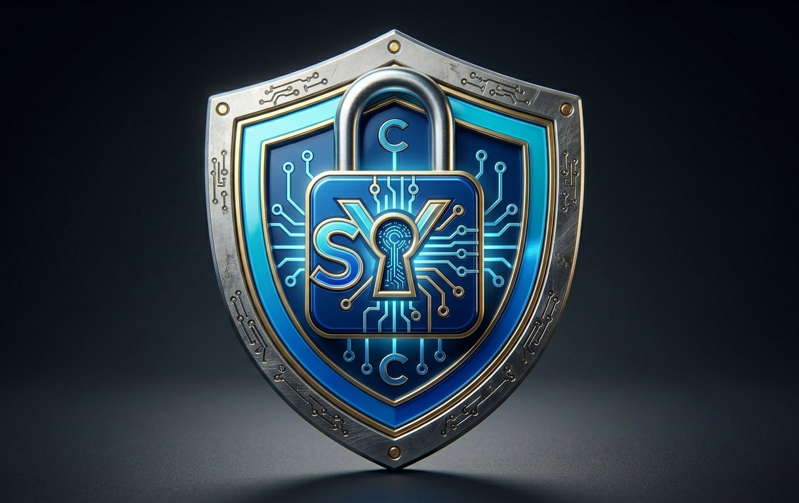

<p align="center">
  
</p>
# Syrax Ultimate Crypto Vault 

An advanced, terminal-based, deterministic password generation and recovery system written in Python. Unlike traditional password managers that store your plain-text credentials in a vulnerable cloud database, **Syrax** uses cryptographic hashing, salt stretching, and custom symmetric logic to calculate your passwords on-the-fly. 

Input the exact same criteria (Platform + Salt + Number), and it will reliably reproduce your unique, high-entropy password anywhere, anytime.

---

## Key Features

* **Deterministic Architecture:** Your actual passwords are *never stored anywhere*. They are calculated when needed and forgotten when closed.
* **Beautiful CLI UI:** Full integration of ANSI styling and type-safe verification banners tailored perfectly for Windows terminals (VS Code Terminal, PowerShell, and Windows Terminal).
* **Robust Input Validation:** Prevents accidental typos or empty strings using regex-matching and safe character bounds.
* **Reversible Token Metrics:** Includes a built-in decoder logic to break down your platform anchors and check the cryptographic entropy of your keys.
* **Local Vault Logging:** Saves metadata references (timestamps, salts, and password hashes) locally to an `ultimate_vault.txt` file without exposing the resulting plaintext strings.
* **Native Windows Clipboard Support:** Automatically copies your generated passwords straight to your Windows clipboard using the native `clip` command.

---

## Dependencies & Prerequisites

Syrax is built completely with **built-in standard libraries**, requiring **no `pip install` commands** for core functions.

### Core Modules Used:
* `secrets` & `hashlib` — For generating cryptographically secure components and generating SHA-256 validation points.
* `hmac` — For custom Keyed-Hashing implementation and secure hashing blocks.
* `getpass` — Masks user inputs natively in the terminal so shoulder-surfers can't steal your master keys.
* `base64` & `string` — Processes byte data arrays into secure, alphanumeric text strings.
* `subprocess` — Interfaces with your OS kernel pipeline to handle copy-paste logic.
* `re`, `sys`, `os` — Manages platform boundaries, arguments, and string sanitization rules.

>  **Windows Note:** Because this script relies entirely on Python's standard library and the native Windows `clip` engine, you do not need to install any external dependencies or prerequisites!

---

## 🛠️ Installation & Execution on Windows

### 1. Grab the Project Files
Clone this repository to your local computer using Git Bash or PowerShell:
```powershell
git clone https://github.com/AMCYD/secure-password-generator.git
